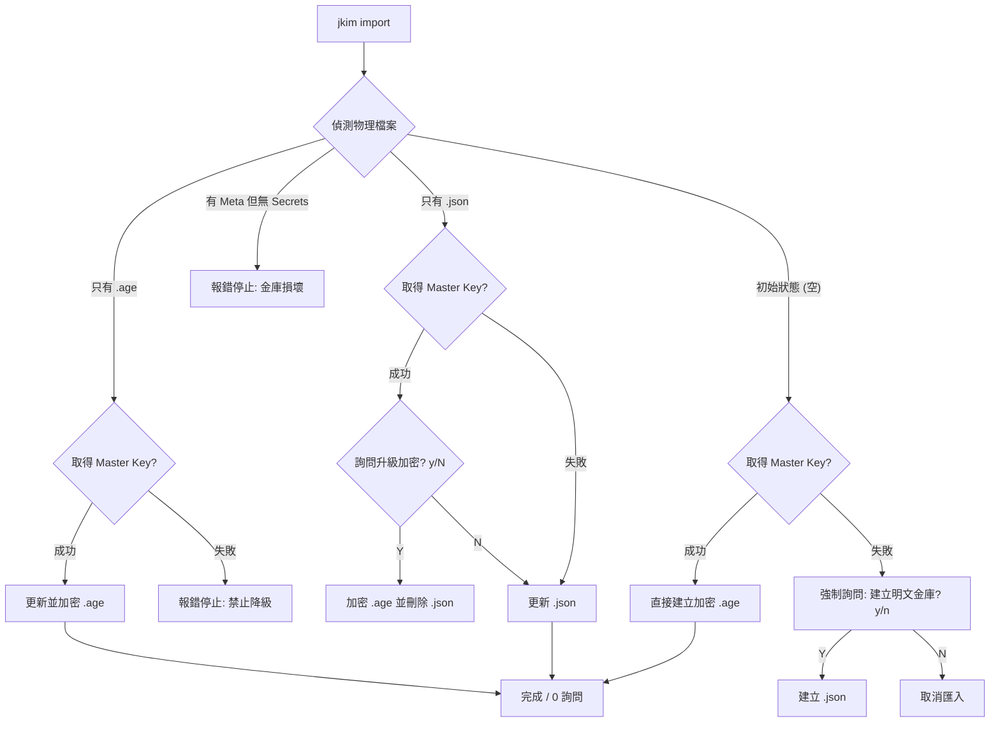

# **Just Keep Identity (jki)：JK Suite 極速 MFA 數位金庫**

## **產品需求 (PRD) 與技術規格 (Spec) 文件 - V29 (ACL 授權優化與原生效能版)**

### **第一章：品牌與核心原則 (Principles)**

#### **1.4 金庫狀態與認證邏輯 (Vault States & Auth Logic)**
*   **無感解鎖 (Lazy Unlock)**：`jki-agent` 啟動時預設為 Locked。當 `jki` 執行查詢時，若發現 Agent 已鎖定，應根據啟動配置主動調用認證（如 Biometric）並實現 Session 快取。
*   **認證職責隔離 (Auth Separation)**：
    *   **Agent (High-Privilege)**：唯一的系統級安全框架對接口。負責調用 **Biometric (OS 原生生物辨識)** 或系統 Keychain。
    *   **CLI (Lightweight)**：獨立運作時不調用系統級安全框架，僅限檔案或直接互動。

### ---

**第二章：架構定義 (Architecture)**

#### **2.2 代理服務與可視化管理 (jki-agent)**
*   **定位**：唯一的 Session 管理器與高權限認證門戶。負責在記憶體中快取解密後的 Secrets 與 Master Key。
*   **自治解鎖**：若 Agent 以 `-A biometric` 啟動，當收到查詢請求且處於 Locked 狀態時，應自動發起系統驗證，對 CLI 透明。
*   **跨平台形態**：macOS/Windows 提供選單列圖示 (Menu Bar)，Linux CLI 為純背景 Daemon。

#### **2.3 權威來源旗標 (-A, --auth)**
為顯式指定認證來源並實現 Fail-fast 策略，所有組件支援 `-A, --auth <SOURCE>` 參數。

| 參數值 (`-A`) | 行為 (Behavior) | 適用組件 |
| :--- | :--- | :--- |
| **`biometric`** | 強制調用 **OS 原生生物辨識** (macOS TouchID / Windows Hello)。 | `agent` |
| **`agent`** | 強制僅向 `jki-agent` 請求 (Session 快取)。 | `jki`, `jkim` |
| **`plain`** | 強制僅讀取 `vault.json` (零延遲明文)。 | 全組件 |
| **`mkey`** | 強制僅讀取物理 `master.key` 檔案 (0600)。 | 全組件 |
| **`interactive`** | 強制 Stdin 互動輸入 (Ask Pwd)。別名 `-I`。 | 全組件 |

**認證優先序路徑 (Default Priority Path):**
*   **CLI Path**: `Agent` > `Plain` > `MasterKey` > `Interactive`.
*   **Agent Path**: `Biometric` > `MasterKey` > `Interactive`.

### ---

**第三章：安全硬化標準 (Security Hardening)**

#### **3.1 代理通訊安全**
*   Local Socket 必須強制執行 **0600 (Owner Only)** 權限。
*   Master Key 在 Agent 記憶體中應使用 `SecretString` 保護。

#### **3.2 Keychain ACL 權限管理 (macOS 特色)**
*   **信任共用**：在寫入系統 Keychain 時，應透過 `security` 指令的 `-T` 參數，同時將 `jkim` 與 `jki-agent` 加入受信任程式清單。
*   **單一彈窗**：正確的 ACL 管理確保了在跨程式（從 `jkim` 到 `jki-agent`）存取同一密鑰時，作業系統僅會彈出一次驗證視窗，消除冗餘授權。

### ---

**第四章：身分獲取與即時核對 (Identity Access & Feedback)**

#### **4.1 執行器強化 (jki)**
為支援開發者核對與帳號遷移，`jki` 具備超越產碼的「物理身分」讀取能力：
*   **物理金鑰讀取 (-S, --show-secret)**：唯一匹配時輸出原始 Base32 Secret。
*   **完整身分導出 (-U, --uri)**：唯一匹配時輸出標準 `otpauth://` URI。
*   **剪貼簿行為**：請求 Secret 或 URI 時，系統應自動將該字串複製至剪貼簿（除非指定 `--stdout`）。

#### **4.2 管理中心反饋 (jkim add)**
為確保手動新增資料的正確性，`jkim add` 遵循「即時物理驗證」原則：
*   **顯式回饋 (-S, --show-secret)**：成功新增帳號後，若指定此旗標，系統應主動印出該帳號的 Secret 與 URI，以便使用者立即進行離線備份或實體比對。

---
*Status: Architecture Baselined (V30 - Identity Feedback Optimized).*

## **附錄 A：金庫狀態與匯入邏輯決策 (Vault State & Import Logic)**

為確保安全性 (Security) 與人體工學 (UX) 的平衡，`jkim import-winauth` 遵循以下硬化後的決策矩陣。

### **A.1 決策流程圖 (Decision Flow)**



### **A.2 職責邊界規範 (Boundaries)**
1.  **認證優先序**：日常操作僅限 `Agent` > `Keyfile` > `Interactive`。**禁止**直接調用系統 Keychain。
2.  **安全性不退讓**：若現狀為加密態，認證失敗時**絕對禁止**降級為明文。
3.  **最小干擾**：在「維持加密態」或「維持明文態且無金鑰」時，執行 **0 詢問**。

### **A.3 邏輯虛擬碼 (Pseudo-code)**

```rust
fn handle_import() {
    // 1. 狀態預檢
    let state = detect_vault_state(); // { has_age, has_json, has_meta }
    if state.has_meta && !state.has_age && !state.has_json {
        error("Vault corrupted: Metadata exists but secrets are missing.");
        return;
    }

    // 2. 受限認證取得 (不傳入 Keychain Store)
    let key = acquire_master_key(Auth::Auto, interactor, None).ok();

    // 3. 核心決策分支
    match (state.has_age, state.has_json) {
        (true, _) => { // 加密態優先
            let k = key.expect("Authentication required for encrypted vault.");
            let vault = decrypt_age(path_age, k);
            let updated = merge(vault, new_data);
            save_age(updated, k);
        },
        (false, true) => { // 明文態
            let vault = read_json(path_json);
            let updated = merge(vault, new_data);
            if let Some(k) = key {
                if interactor.confirm("Master Key detected. Upgrade to Encrypted? [y/N]", false) {
                    save_age(updated, k);
                    delete_file(path_json);
                } else {
                    save_json(updated);
                }
            } else {
                save_json(updated); // 0 詢問，維持明文
            }
        },
        (false, false) => { // 初始狀態
            let updated = merge(empty_vault, new_data);
            if let Some(k) = key {
                save_age(updated, k); // 0 詢問，自動保護
            } else {
                if interactor.confirm("No Key. Create as PLAINTEXT vault? [y/n]", false) {
                    save_json(updated);
                } else {
                    exit("Import cancelled.");
                }
            }
        }
    }
}
```
